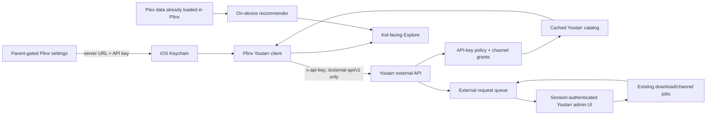

# Youtarr + Plinx Explore implementation plan

Status: Youtarr release candidate implemented locally; full-stack gate pending
Testing branches: Youtarr `external-api-integration`, Plinx work parked
Youtarr base: latest upstream `dev` at branch creation
Youtarr delivery model: sequential independently reviewable PR slices
Plinx delivery model: sequential PRs after the Youtarr contract is validated

No PR is open. Youtarr automated suites, lint, TypeScript, production build,
fresh Docker startup, pre-feature upgrade, immediate external-key
authentication, idempotent restart, request-migration
rollback/re-application, revocation, and feature shutdown pass locally.
The Youtarr browser gate now covers constrained-key creation, policy editing,
channel grants, revocation, and safe review/rejection of video, channel, and
delete requests. The 5,000-video bounded-feed performance gate also passes.
The downloader matrix, proxy, real-download, and LAN/dev evidence remain
pending or blocked in `EXTERNAL_API_VALIDATION.md`. Plinx roadmap completion is
not claimed.

## 1. Product outcome

Plinx gains a parent-enabled Explore experience that browses only channels
explicitly granted to its Youtarr API key. Children can inspect compact video
details and request eligible videos or channels. Plinx reflects request and
download status without exposing Youtarr's admin UI or external links.

Recommendations use the child's existing Plex experience as an on-device
signal. Raw Plex history, profile data, and recommendation events are not sent
to Youtarr or any third party.

Youtarr gains a separately deployable `/external-api/v1` boundary with:

- mandatory API-key authentication;
- least-privilege roles and server-enforced policy;
- per-key channel grants;
- cached catalog reads and authenticated local assets;
- idempotent approval-backed requests;
- an admin approval and audit surface;
- predictable paging, filtering, rate limits, and error contracts.

## 2. Non-negotiable safety decisions

1. External API access is disabled by default.
2. Existing API keys remain legacy-download-only after migration.
3. New external keys default to no channel grants.
4. Session tokens never authenticate `/external-api/v1`.
5. Every authorization decision is repeated by Youtarr; Plinx filtering is
   defense in depth, not the security boundary.
6. Unrated content is hidden unless the key policy explicitly permits it.
7. Unknown ratings and media types fail closed.
8. Destructive actions are requests, never direct external deletes.
9. Plinx stores the API key in Keychain and never redisplays or logs it.
10. Plinx rejects redirects for credentialed API and asset requests.
11. Plinx never attaches the API key to a public thumbnail host.
12. Kid-facing UI contains no source, legal, YouTube, or other external links.
13. Recommendations are computed locally and do not create a new analytics
    event stream or server-side child profile.

## 3. System boundary



## 4. Authorization model

### Roles

| Role | Read catalog/status | Create video/channel request | Delete request | Review requests |
|---|---:|---:|---:|---:|
| `legacy_download` | No | Existing legacy endpoint only | No | No |
| `view` | Yes | No | No | No |
| `request` | Yes | Yes | No | No |
| `delete` | Yes | Yes | Yes, approval-backed | No |
| `admin` | Yes | Yes | Yes, approval-backed | No |

`admin` is an external policy superset, not remote review authority. Review
always requires a Youtarr session.

### Policy fields

- `autoApproveVideoRequests`
- `autoApproveChannelRequests`
- `autoApproveDeleteRequests`
- `maxRatingLevel` (`1...4`)
- `allowUnrated`
- `allowedMediaTypes`
- explicit granted channel database IDs
- revocation timestamp

Role grants the maximum possible operation. Policy and resource grants further
constrain it. A capability is usable only when all three permit it:

`role scope AND key policy AND resource grant`.

### Rating levels

Youtarr's existing rating mapper remains the source of truth:

- level 1: `G`, `TV-Y`, `TV-G`
- level 2: `PG`, `TV-Y7`, `TV-PG`
- level 3: `PG-13`, `TV-14`
- level 4: `R`, `NC-17`, `TV-MA`

Null, unrecognized, and malformed values are treated as unrated. They are
returned only when `allowUnrated` is true.

## 5. Youtarr data model

### `apikeys` additions

Already established by the foundation slice:

- role
- three auto-approval flags
- maximum rating level
- allow-unrated flag
- allowed media types
- revocation timestamp

### `api_key_channel_grants`

- `id`
- `api_key_id` foreign key to `apikeys.id`
- `channel_id` foreign key to `channels.id`
- `created_at`
- unique constraint on `(api_key_id, channel_id)`
- indexes on each foreign key
- cascading removal when either parent is removed

No row means no access. Disabled or terminated channels remain invisible even
if an old grant row exists.

### `external_requests`

- `id`: opaque UUID exposed to clients
- `api_key_id`: requesting key
- `request_type`: `video`, `channel`, or `delete_video`
- `status`: `pending`, `approved`, `processing`, `completed`, `rejected`,
  `failed`, `cancelled`
- `active_dedupe_key`: nullable unique key for active target deduplication
- `idempotency_hash`: per-key hash of the optional client idempotency value
- `youtube_id`: nullable
- `channel_id`: nullable database channel reference
- `channel_url`: nullable normalized URL
- `grant_to_requesting_key`: persisted channel approval decision
- `message`: nullable bounded terminal/rejection message
- `job_id`: nullable existing Youtarr job reference
- `created_at`, `updated_at`, `decided_at`, `completed_at`

Indexes:

- `(api_key_id, created_at)`
- `(api_key_id, status)`
- `(api_key_id, request_type, youtube_id, created_at, id)`
- `(request_type, status, created_at, id)`
- unique `active_dedupe_key`
- unique `(api_key_id, idempotency_hash)`

Request history remains after key revocation for audit purposes, but revoked
keys cannot read it.

### Audit records

Use structured application logs first, never request bodies or credentials.
Persist a dedicated audit table only if durable in-product history cannot be
served safely from request records.

Log fields:

- API key database ID and display prefix/name
- method and route template, not raw query strings
- response class
- request UUID where applicable
- authorization failure reason code
- duration

Do not log API keys, Plex identifiers, raw YouTube URLs supplied by a client,
descriptions, or response bodies.

## 6. External API contract

All responses use JSON except authenticated image bytes. All list endpoints
use `page` and `pageSize`, with `pageSize` clamped to `1...100`. Sort order has
a stable tie-breaker so repeated paging cannot shuffle equal rows.

### Capability negotiation

`GET /external-api/v1/capabilities`

Returns:

- API and server versions
- role and scopes
- normalized policy
- feature flags for catalog, requests, channel requests, delete requests,
  recommendations, and authenticated assets

Plinx hides or disables unsupported features based on this response.

### Channel catalog

`GET /external-api/v1/channels`

Filters:

- `page`, `pageSize`
- `search`
- `subfolder`
- allowlisted `sortBy` and `sortOrder`

Each item:

- database `id`
- YouTube `channelId`
- `title`
- bounded `descriptionSummary`
- same-origin authenticated `thumbnailUrl`
- `subfolder`
- `videoCount`
- `downloadedCount`
- `lastFetchedAt`

Only enabled, non-terminated, explicitly granted channels are counted.

### Channel videos

`GET /external-api/v1/channels/:id/videos`

Filters:

- `page`, `pageSize`
- `status`
- `search`
- `sortBy`, `sortOrder`
- `tabType`
- `dateFrom`, `dateTo`
- `minDuration`, `maxDuration`

Each item:

- `youtubeId`
- `title`
- thumbnail URL
- `publishedAt`
- duration in seconds
- bounded description when cached
- `isDownloaded`
- `isRequested`
- `requestStatus`
- normalized rating
- channel database ID and title
- normalized media type

Metadata:

- deterministic pagination
- `dataSource`
- `isFullyIndexed`
- `lastIndexedAt`
- safe `indexingHint`

The route reads cached/database records. It never performs a synchronous
YouTube or yt-dlp refresh.

### Authenticated assets

- `GET /external-api/v1/assets/channels/:id/thumbnail`
- `GET /external-api/v1/assets/videos/:youtubeId/thumbnail` when a local image
  exists

Asset rules:

- require the same API key and resource grant;
- validate identifiers before building a filesystem path;
- resolve and verify the final path remains inside the configured image root;
- use explicit MIME type, ETag/Last-Modified, bounded cache headers, and 404;
- never expose local paths or distinguish absent from unauthorized resources;
- return public YouTube thumbnail URLs in catalog JSON when no local asset
  needs protection, allowing Plinx to fetch without a key.

### Video request

`POST /external-api/v1/requests/videos`

Input:

- exactly one normalized YouTube ID or supported canonical URL
- optional granted channel database ID
- optional idempotency key

Rules:

- request-capable role required;
- rating/media/channel policy rechecked;
- existing downloaded item returns `already_downloaded`;
- an active duplicate returns the existing request;
- auto-approval is allowed only for a video that belongs to a granted,
  subscribed channel;
- otherwise status begins as `pending`;
- response never waits for the download to complete.

### Channel request

`POST /external-api/v1/requests/channels`

Input:

- supported canonical channel URL
- optional idempotency key

Rules:

- request-capable role required;
- input is normalized before deduplication;
- resolution is bounded and cannot become an unbounded browse call;
- default is pending;
- auto-approval requires the explicit key policy;
- approving creates/enables the channel through existing provisioning logic,
  then grants it to the requesting key unless the admin chooses otherwise.

### Request status

- `GET /external-api/v1/requests`
- `GET /external-api/v1/requests/:id`

An external key sees only its own requests. Filters are allowlisted. Status
transitions are monotonic except an explicit retry transition from `failed` to
`processing`.

### External error shape

```json
{
  "error": {
    "code": "approval_required",
    "message": "This request is waiting for approval.",
    "requestId": "opaque-request-id"
  }
}
```

Messages are safe for display. Internal exception details never cross the
boundary.

## 7. Youtarr admin UX

### API Keys & External Access

For each non-legacy key:

- role selector with plain-language risk description;
- policy toggles enabled only when meaningful for that role;
- rating ceiling and unrated control;
- allowed media types;
- approved channel picker with search, select-all-current-page, and count;
- last used, use count, created date, revoked state;
- one-time key reveal only at creation;
- revoke action instead of hard delete.

Saving grants replaces the exact set transactionally. A warning appears when a
role or policy change would reduce access. Increasing privilege requires
explicit confirmation.

### Requests area

Initial screens:

- pending queue, newest first;
- history;
- type/status/key filters;
- detail showing target, requester key, timestamps, policy decision, and
  current job state;
- approve/reject individual action;
- optional bounded bulk action later.

Approval revalidates current key policy, channel state, rating, media type,
duplicate state, and target validity. It does not trust the snapshot captured
when the request was created.

## 8. Plinx architecture

### Configuration

- normalized base URL in UserDefaults;
- API key in Keychain using
  `kSecAttrAccessibleWhenUnlockedThisDeviceOnly`;
- Explore-enabled preference off by default;
- connection test uses unsaved draft inputs without persisting them;
- narrow local-network ATS support; public HTTP rejected.

### Networking

- one typed client for `/external-api/v1`;
- ephemeral, cookie-less, cache-less credentialed session;
- reject all redirects;
- `x-api-key` only;
- bounded timeouts;
- cancellation follows view lifecycle;
- generic user errors, no response-body logging.

### Images

- same-origin `/external-api/v1/assets/...` requests use the API-key session;
- public absolute thumbnail URLs use a separate uncredentialed image session;
- unknown hosts never receive the key;
- bounded in-memory decoded-image cache;
- HTTP cache validators may be honored without persistent cross-profile
  tracking;
- cancel image work when cards disappear.

### Explore surfaces

Parent setting:

- connection summary and capability result;
- Enable Explore toggle;
- optional recommendation toggle;
- allowed-rating summary received from Youtarr;
- no credential reveal and no child-facing links.

Kid entry point:

- visible only when configured and explicitly enabled;
- capability check before showing catalog data;
- failure state cannot fall back to an unrestricted source.

Explore root:

- search;
- recommended section when locally available;
- approved-channel grid;
- recently indexed/downloaded-safe sections where supported;
- loading, empty, offline, retry, and configuration-removed states.

Channel detail:

- compact thumbnail grid/list;
- title, duration, publish date, rating, downloaded/request state;
- deterministic load-more paging;
- no infinite uncontrolled prefetch;
- request button only when capability and item eligibility allow it.

Requests:

- My Requests list;
- pending/approved/processing/completed/rejected/failed badges;
- refresh on foreground and user pull-to-refresh;
- conservative bounded polling only while visible and pending work exists;
- no background analytics or notification dependency in phase 1.

## 9. On-device recommendation engine

### Inputs

Use only Plex data already available to the active Plinx session:

- recently watched and continue-watching titles;
- genres/categories already returned for those items;
- library type;
- recency and completion state.

Use Youtarr catalog metadata already fetched for approved channels:

- title tokens;
- channel identity;
- media type;
- publish recency;
- rating eligibility;
- downloaded/requested state.

No raw Plex signal is included in Youtarr requests.

### Candidate generation

1. Start with eligible videos from granted channels.
2. Exclude items blocked by either Youtarr policy or Plinx safety policy.
3. Exclude completed Plex/Youtarr matches where confidence is high.
4. Prefer cached catalog pages and a bounded recommendation feed endpoint only
   if it returns policy-filtered candidates without receiving Plex history.

### Initial scoring

Normalize each component to `0...1`:

- title/category token similarity: 35%
- channel affinity from prior matched Youtarr/Plex items: 25%
- freshness with a capped decay: 15%
- unwatched/download availability: 15%
- diversity bonus: 10%

Apply penalties:

- repeated channel in the preceding cards;
- already requested unless shown in a status section;
- missing required metadata;
- low-confidence text-only match.

Use deterministic tie-breaking by published date then YouTube ID. The engine
must be explainable in tests and cannot use opaque remote ML.

### Diversity and safety

- cap consecutive results per channel;
- reserve multiple channels when candidates permit;
- never relax rating or grant filters to fill a row;
- when signals are insufficient, label the section generically as Explore
  rather than implying personalization;
- recommendation toggle off removes use of Plex signals immediately.

## 10. Rate limiting and deployment

Per-key limits:

- capability and browse: generous read bucket;
- assets: separate higher bucket;
- request creation: smaller write bucket;
- review actions: admin/session limiter;
- keys do not share a bucket merely because they share an IP.

Proxy guidance will include Nginx, Caddy, and Traefik examples that expose only
`/external-api/*`. Main UI, Swagger, health details, and admin APIs remain
private or behind stronger authentication.

Trust forwarded IP headers only when proxy trust is explicitly configured.
Rate-limit identity remains API-key ID after successful authentication.

## 11. Delivery slices

### Youtarr

1. Foundation/auth model — complete.
2. Per-key channel grants and cached catalog read APIs.
3. Authenticated assets and external OpenAPI/read documentation if not fully
   included in slice 2.
4. Request table, idempotency, video request creation, and status reads.
5. Channel request creation and approval execution.
6. Session-admin Requests API and web queue.
7. API-key policy/grant settings UI.
8. Reverse-proxy, operations, migration, and compatibility documentation.
9. Legacy download compatibility decision and cleanup.

Each slice receives focused tests, lint, migration up/down coverage, a
security review, and a conventional commit before the next begins.

### Plinx

1. Secure connection/settings foundation — complete.
2. Capability-gated approved-channel and video browsing.
3. Video/channel request actions and My Requests state.
4. On-device Plex-informed recommendation ranking.
5. Parent controls, accessibility, visual polish, offline/error behavior.
6. Cross-repo contract fixtures and end-to-end test harness.

All Plinx work remains on `youtarr-explore-api`, with conventional commits for
review checkpoints.

## 12. Verification matrix

### Contract

- shared JSON fixtures decode in Plinx and match Youtarr route tests;
- API major-version incompatibility fails visibly and safely;
- unknown additive fields remain forward compatible;
- unknown role/scope/rating/media values do not broaden access.

### Authorization

- missing, invalid, revoked, and legacy keys fail on every external read/write;
- session token alone fails;
- grants cannot leak channels through counts, search, direct IDs, or assets;
- one key cannot read another key's requests;
- role and policy reductions take effect immediately.

### Paging and performance

- stable tie-breakers;
- page bounds and malformed filters;
- thousands-of-videos fixture without full-table application loading;
- query plans use grant/channel/status indexes;
- assets and list requests cancel when Plinx views disappear.

### Requests

- duplicate concurrent submissions converge on one active request;
- downloaded targets return `already_downloaded`;
- approval revalidates policy;
- rejection is terminal;
- job completion/failure updates request status;
- revoked keys cannot poll.

### Privacy and kid safety

- key exists only in Keychain;
- redirects never carry credentials;
- public hosts receive no API key;
- logs contain no keys, raw Plex history, or response bodies;
- external links absent from child UI;
- recommendation input never leaves device;
- rating/unrated rules tested in both server and client.

### Accessibility and UX

- Dynamic Type and VoiceOver labels;
- minimum touch targets;
- reduced-motion behavior;
- loading/empty/offline/retry states;
- request status conveyed by text/icon as well as color;
- parent-only configuration remains behind the parental gate.

## 13. Rollout and compatibility

1. Ship migrations with the external feature flag off.
2. Create a new non-legacy key; do not repurpose an existing bookmarklet key.
3. Assign minimal role/policy and explicit channel grants.
4. Enable the external API and expose only its proxy path.
5. Connect Plinx and verify capabilities.
6. Parent explicitly enables Explore.
7. Enable request workflows after catalog validation.
8. Enable recommendations after local-only behavior is verified.

Rollback:

- disabling the feature flag immediately removes the external namespace;
- revoking the key immediately removes Plinx access;
- disabling Explore removes the child entry point;
- migration rollback disables non-legacy keys before dropping role columns so
  downgrade cannot broaden access.

## 14. Definition of done

- A parent can create a constrained key, grant selected channels, connect
  Plinx, and enable Explore.
- Plinx displays only eligible videos from those channels with useful compact
  metadata and safe thumbnails.
- A child can request an eligible item; Youtarr records an idempotent request.
- An admin can approve/reject it; Plinx shows the resulting status and Youtarr
  job completion.
- Recommendations use Plex-derived signals locally and never weaken grants or
  rating policy.
- Both repositories pass focused and regression verification.
- Deployment, auth, policy, request-state, privacy, and rollback behavior are
  documented.
